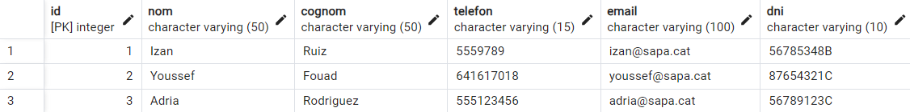
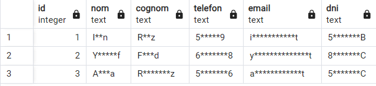
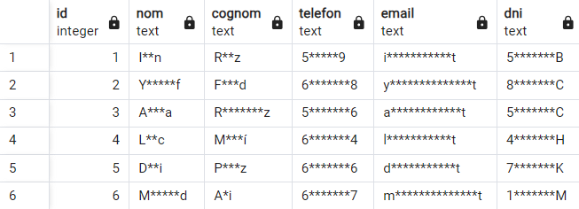

# Base de Dades Repte1: Anonymization & Data Masking for PostgreSQL

Aquest projecte explica com crear i protegir les dades d'una base de dades utilitzant enmascarament. És una guia pas a pas perquè qualsevol pugui aplicar aquest sistema a les seves bases de dades.

---

## 1. Creació de la Taula 

La taula `alumnes` conté informació dels alumnes, com el seu nom, cognom, telèfon, correu electrònic i DNI. Aquesta és la base de dades que volem protegir.

### Estructura de la Taula:
- **`id`**: Identificador únic per a cada alumne.
- **`nom`**: Nom de l'alumne.
- **`cognom`**: Cognom de l'alumne.
- **`telefon`**: Número de telèfon.
- **`email`**: Correu electrònic.
- **`dni`**: DNI de l'alumne.

**Codi SQL per crear la taula:**
```sql
CREATE TABLE alumnes (
    id SERIAL PRIMARY KEY,
    nom VARCHAR(50),
    cognom VARCHAR(50),
    telefon VARCHAR(15),
    email VARCHAR(100),
    dni VARCHAR(10)
);
```

---

## 2. Inserció de Dades d'Exemple

S'han afegit dades d'exemple a la taula `alumnes` per poder provar el sistema d'enmascarament.

**Codi SQL per inserir dades:**
```sql
INSERT INTO alumnes (nom, cognom, telefon, email, dni)
VALUES
    ('Izan', 'Ruiz', '5559789', 'izan@sapa.cat', '56785348B'),
    ('Youssef', 'Fouad', '641617018', 'youssef@sapa.cat', '87654321C'),
    ('Adria', 'Rodriguez', '555123456', 'adria@sapa.cat', '56789123C');
```

> *Nota: Captura de pantalla de la creació de la taula i inserció de dades:*



---

## 3. Creació de la Funció `enmascarar_dades`

Jo he pensat que, si vull protegir les dades sensibles dels alumnes, estaria bé que no es mostressin les seves dades personals. Això vol dir tapar part de la informació, com demana el repte substituint alguns caràcters per asteriscs (`*`), de manera que encara puguem identificar fàcilment a qui es refereix la dada, però sense exposar tota la informació.

### Com funciona la funció:
1. Utilitzo la funció `substr` per obtenir el primer i l'últim caràcter del valor.
2. Genero els asteriscos intermedis utilitzant `lpad`, que crea una cadena de caràcters segons la longitud necessària.
3. Finalment, faig un `concat` del primer caràcter, els asteriscos i l'últim caràcter per retornar el valor enmascarat.

Amb això, he creat una funció en SQL que fa tot aquest procés automàticament cada vegada que inserim un nou alumne.

**Codi SQL per crear la funció:**
```sql
CREATE OR REPLACE FUNCTION enmascarar_dades(valor TEXT)
RETURNS TEXT
AS $$
BEGIN
    -- Enmascarem el valor amb asteriscos entre el primer i l'últim caràcter
    -- Usant LPAD i RPAD per generar els asteriscos
    RETURN substr(valor, 1, 1) || lpad('', LENGTH(valor) - 2, '*') || substr(valor, LENGTH(valor), 1);
END;
$$ LANGUAGE plpgsql;
```

> *Nota: Captura de pantalla amb el resultat esperat:*



---

## 4. Creació de la Vista 'alumnes_mascarats'

Per veure les dades enmascarades, he pensat que seria útil crear una vista que mostri directament la informació enmascarada de la taula `alumnes`. Aquesta vista utilitza la funció `enmascarar_dades` per aplicar l'enmascarament a cada columna.

**Codi SQL per crear la vista:**
```sql
CREATE VIEW alumnes_mascarats AS
SELECT
    id,
    enmascarar_dades(nom) AS nom,
    enmascarar_dades(cognom) AS cognom,
    enmascarar_dades(telefon) AS telefon,
    enmascarar_dades(email) AS email,
    enmascarar_dades(dni) AS dni
FROM alumnes;
```

---

## 5. Consulta de la Vista

Quan consultem la vista `alumnes_mascarats`, podem veure les dades protegides. Això és útil per accedir a la informació sense comprometre la privadesa dels alumnes.

**Codi SQL per consultar la vista:**
```sql
SELECT * FROM alumnes_mascarats;
```

> *Nota: Captura de pantalla que mostra que tot funciona correctament:*



---

## Conclusió

Aquest sistema permet protegir les dades sensibles d'una base de dades mitjançant enmascarament.  
**Fet per:**  
**Youssef Fouad Mabrouki**  
**ASIX 1**  
**INS SA PALOMERA, Blanes**  
Espero ser un dels guanyadors del +0,5.
